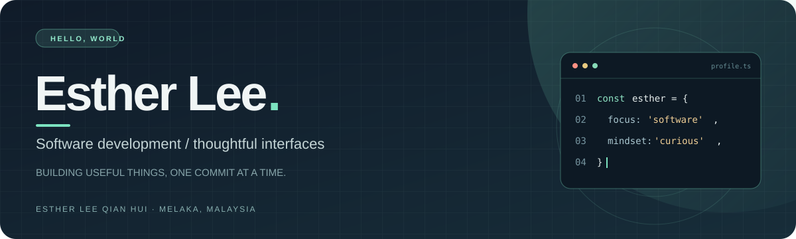

  

   
  <b>Software development student · Builder · Curious about better digital experiences</b>
   
  Melaka, Malaysia · Open to learning, collaboration, and interesting problems

 

## A little about me

I'm **Esther Lee Qian Hui**, an IT (Software) student at **Universiti Teknikal Malaysia Melaka (UTeM)**. I enjoy turning messy workflows into clear, useful tools. My experience spans academic software projects, database-backed applications, and process automation during my application development internship.

- **Currently exploring:** software engineering, UI/UX, databases, and automation
- **How I work:** understand the problem, build a working version, then refine the details
- **What you'll find here:** projects with clear context, thoughtful decisions, and honest documentation

## My toolkit

| Build | Data & workflow | Ways I work |
| :--- | :--- | :--- |
| C++ · SQL | MySQL · UiPath | Requirements · documentation · testing |

*This is a snapshot of tools I've used, not a list of everything I'm learning.*

## Selected work

<table>
<tr>
<td width="50%" valign="top">
<h3>◈ Intelligent Workflow Management System</h3>

A C++ and MySQL task management application with user roles, assignment workflows, status tracking, and reports.

<b>Focus:</b> application logic · relational data · usability in a CLI

</td>
<td width="50%" valign="top">
<h3>◈ Hospital Patient Management System</h3>

An algorithm analysis project exploring sorting and searching performance using a large patient dataset.

<b>Focus:</b> data structures · performance comparisons · clear outputs

</td>
</tr>
</table>

<!-- When a cleaned-up public repository exists, add a link under its card, such as:

<a href="https://github.com/YOUR_USERNAME/YOUR_REPOSITORY">View project →</a>

Do not publish coursework code or internship material without permission. -->

## Next on my workbench

I'm shaping my next public projects around **useful software with an enjoyable interface**. This space will grow as each project is built and documented.

- A small product with a polished end-to-end user flow
- A dashboard that turns raw information into clear decisions
- An automation that saves someone repetitive work

## Beyond the code

I like projects where both the **system behind the screen** and the **experience on the screen** matter. I have also worked on fault reporting, ticketing workflows, and SAP-related automation during my internship.

   
  Thanks for stopping by · More projects coming soon

