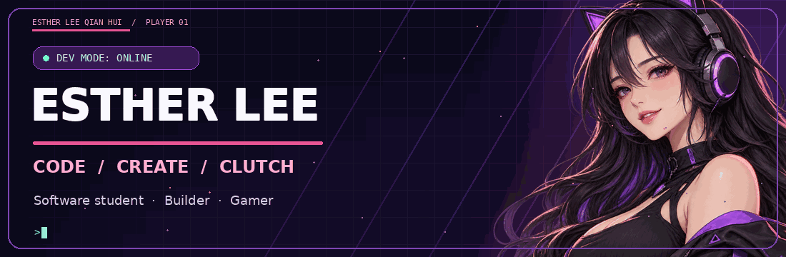
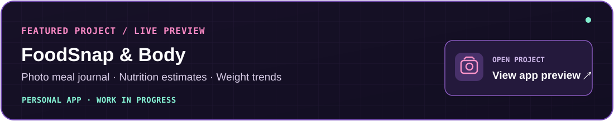
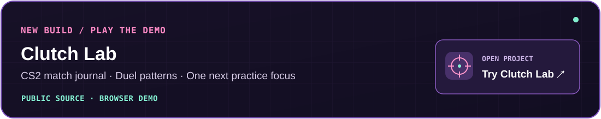
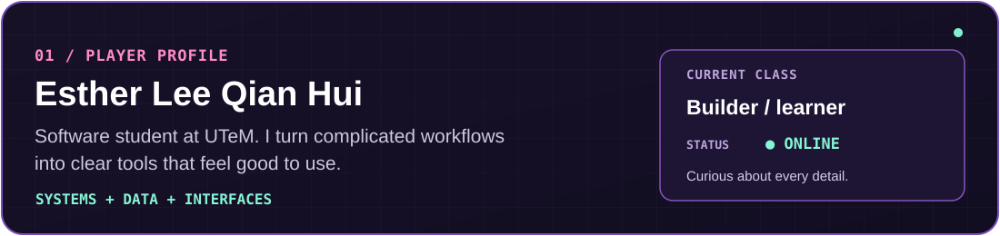
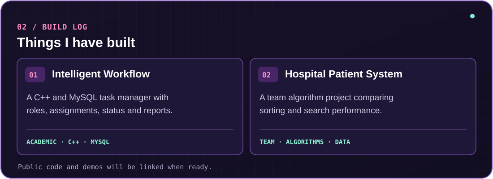
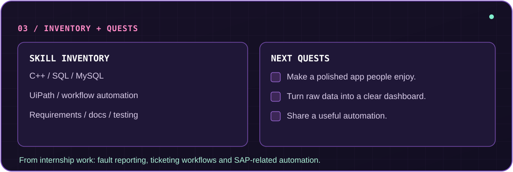
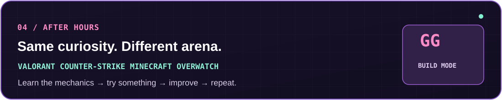

  

 

  

 

  

 

 

 

 

Read my profile in text

I'm **Esther Lee Qian Hui**, an IT (Software) student at **Universiti Teknikal Malaysia Melaka (UTeM)**. I enjoy turning complicated workflows into practical tools with thoughtful interfaces.

- **Intelligent Workflow Management System:** An academic C++ and MySQL task manager with roles, assignments, status updates, and reports.
- **Hospital Patient Management System:** A team algorithm project comparing sorting and searching methods on a large dataset.
- **Tools I've used:** C++, SQL, MySQL, UiPath, workflow automation, requirements, documentation, and testing.
- **Internship experience:** Fault reporting, ticketing workflows, and SAP-related automation.
- **FoodSnap & Body:** [Live preview](https://ais-pre-dsrhuffgag43w67cmsxg43-69964347795.asia-east1.run.app/) · [Project README](https://github.com/assumie/foodsnap-body) — a photo-based meal journal with nutrition and weight views.
- **Clutch Lab:** [Live demo](https://assumie.github.io/clutch-lab/) · [Source and setup](https://github.com/assumie/clutch-lab) — a CS2 practice journal for reviewing match patterns.
- **After hours:** Valorant, Counter-Strike, Minecraft, and Overwatch.

